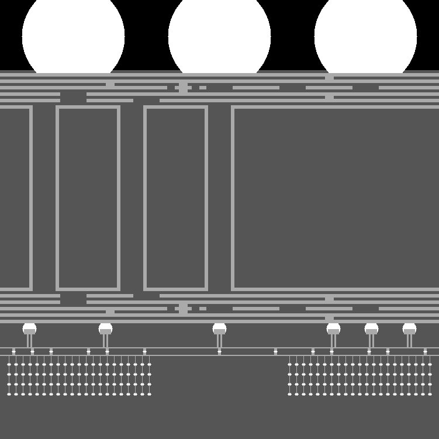
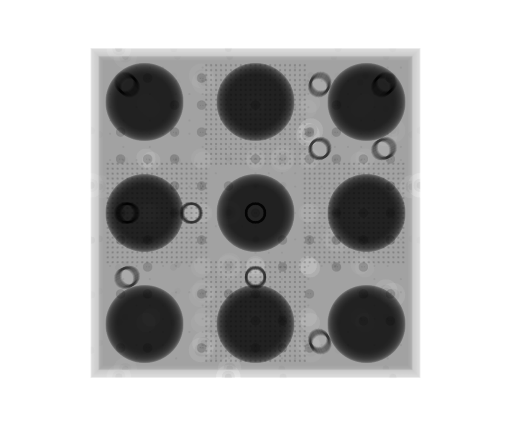
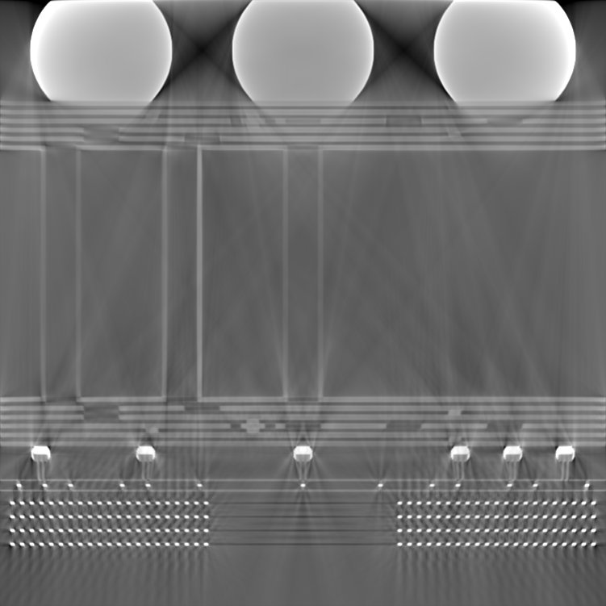

# X-ray Simulations of Chip Packages (xsim-chip)

A synthetic chip, or semiconductor package, has been procedurally created using
Python. While the generated semiconductor package is simplified relative to a
real package, the generated package contains representative geometric features
to those observed in real X-ray computed tomography (XCT) measurements. The 
geometry and materials of the generated package are represented by a stack
of images, much like a volume is represented by a stack of (reconstructed) 
images in XCT. With the geometry in hand, simulations of XCT are carried out
next, resulting in simulated X-ray projection images, also known as radiographs.
These projection images are then reconstructed using conventional algorithms,
resulting in a stack of images that represent the same volume as the generated
package but now contain (simulated) XCT artifacts. Additional details of the
these steps and file hierarchy are provided in the following sections.

---

## Installation of Python Dependencies

A virtual environment is highly recommended before installing the necesasry
dependencies. Note, we recommend using either Python 3.11 or Python 3.12. The
virtual environment should be created using the conda (or mamba) package
managers, which can be installed via the open-source 
[miniforge](https://github.com/conda-forge/miniforge) library. 

The conda (or mamba) package manager is preferred because our python scripts
depend on astra-toolbox, and this package requires the conda package manager
for general installations.

The necessary dependencies to run our Python scripts are provided in the
included "xct_sim_env_conda.yml" file. This file can be used to install the
necessary dependencies via the command,
```
  conda create --file /path/to/xct_sim_env_conda.yml
```
where "/path/to/xct_sim_env_conda.yml" is replaced with the actual path to
the .yml file provided in this repository. Note, for older installations of
conda, you may need to use a different syntax,
```
  conda env create --file /path/to/xct_sim_env_conda.yml
```
Upon completion, this will create a new virtual (conda) environment. To activate
this environment, simply type,
```
  conda activate xct_sim_env
```
There is a Python (i.e., Cython) extension used in the generation of the .stl
files representing the simplified chip package. This extension must be compiled
for one of the scripts to run successfully. The specific script
is, "2_make_stl_model_v2.py", which is located in "./1_generate_chip_imgs".
This extension, named "img2stl", has already been compiled for Windows x64
machines running Python 3.11 or 3.12. The precompiled extensions for Windows
are .pyd files. If a different operating system is used, or a different version
of Python, then this extension must be manually compiled by the user. This will
require installation of a C compiler. Additional instructions are provided
in "ReadMe_Cython_Extension.txt" located in "./1_generate_chip_imgs/cython".

To run a Python script within your activated virtual conda (or mamba) 
environment, simply type the following,
```
  python /path/to/script.py
```

## Directory Tree

```
Simulations_XCT_Chip_Python
 |-- 1_generate_chip_imgs
 |    |-- cython
 |    |    +-- build
 |    |         |-- lib.win-amd64-cpython-311
 |    |         |-- lib.win-amd64-cpython-312
 |    |         |-- temp.win-amd64-cpython-311
 |    |         +-- temp.win-amd64-cpython-312
 |    +-- imgs_out_750p
 |         |-- feature_list_Cu
 |         |-- feature_list_Si
 |         +-- feature_list_Sn
 |-- 2_xct_simulation
 |    |-- sim_radios_cone_beam_pixsz4um
 |    +-- sim_radios_parallel_beam_pixsz4um
 +-- 3_xct_reconstruction
      |-- recon_imgs_cone_beam_pixsz4um
      +-- recon_imgs_parallel_beam_pixsz4um
```
The workflow to procedurally generate a chip-like package, simulate X-ray
projection images, and then reconstruct these projection images is accomplished
in three distinct steps. The first step, which involves generating the
synthetic chip package, utilizes Python scripts found in the subdirectory, 
"1_generate_chip_imgs". This first step also involves transforming the resultant
images into 3D meshes in preparation for next step. The second step, which
involves simulating X-ray projection images, utilizes Python scripts found in
the subdirectory, "2_xct_simulation". Finally, the third step, which involves
reconstructing the X-ray projection images, utilizes Python scripts found in the
subdirectory, "3_xct_reconstruction". Additional information about each of 
these steps in this workflow are described in the following sections.

Due to file size limitations, the image files are not included in this git 
repository. Running the scripts as is will create the files. Alternatively, the 
image files can be downloaded from the corresponding NIST data repository. 
(Update: Publicly available data repository still pending -- April 15, 2026)


## 1.1) Procedurally Generate a Synthetic Chip Package

The first step in this workflow is to generate a semiconductor package that is
both simplified compared to a real package, as well as representative of a real
package. The Python scripts used to create this generated package can be found
in the subdirectory, "./1_generate_chip_imgs". 

The primary script that generates this geometry is "1_main_gen_chip_v3.py".
Helper functions for this script are imported from "draw_chips_lib.py"
and "imppy_lib.py". This script will create chip features representing a
cubical volume of 3.004 mm^3. The volume will be discretized into voxels with
edge lengths of 4.0 um, implying that the pixel size is 4.0 um/pixel. So, the
cubical volume can be thought of as a 3D matrix with each dimension containing
751 elements, and the values of each element are grayscale intensities that
correspond to a specific material. 

The 3D matrix is stored as a multi-page tif image (8-bit unsigned), akin to an
image stack, where each 2D image represents a slice through the 3D matrix.
Black pixels with intensity 0 correspond to no material, or a vacuum. Dark gray
pixels with intensity 85 correspond to insulation layers made of silicon
dioxide. Light gray pixels with intensity 170 correspond to copper layers.
Finally, white pixels with intensity 255 represent lead-free solder, commonly
known as SAC305. 

The exported multi-page tif file can be found in the subdirectory, 
"./1_generate_chip_imgs/imgs_out_750p". The volume (or 3D array of intensities)
can be naturally sliced in one of three orthogonal directions. Therefore,
three multi-page tif files are exported, each corresponding to one of these
diretions. The names of these three exported image files are,

  1) "./1_generate_chip_imgs/imgs_out_750p/simplified_chip_750p_Front.tif"

  2) "./1_generate_chip_imgs/imgs_out_750p/simplified_chip_750p_Side.tif"

  3) "./1_generate_chip_imgs/imgs_out_750p/simplified_chip_750p_Top.tif"

Although the procedurally generated chip package contains a degree of
randomness, the pseudo-random number generators utilize fixed seeds. Therefore,
the same geometry will be generated each time the script is executed as it
currently stands.

While python packages like "tifffile" naturally work with multi-page tif files,
software like ImageJ/FIJI can be used to visually explore these tif files. FIJI
can be downloaded from [here](https://imagej.net/software/fiji/downloads").

A representative example of an image-slice through the generated volume of the
synthetic package is given below.




## 1.2) Convert the Generated Images to STL Volumes

The last part of the first step is to prepare the generated chip package,
represented as an image stack in a multi-page tif file, for the X-ray
simulation. As will be explained in a later section, the simulation of X-ray
projections will be handled by a library called gVirtualXray (gVXR). This
library will compute the X-ray projections of the generated chip package at
different angles, but to do so, each material in the cubic volume must be
represented by water-tight, polygon meshes. These meshes will be saved in
the widely known .stl file format. Thus, the second step of this workflow is to
convert the generated images into triangular meshes.

The script that performs this image-to-stl conversion is located in the same
directory, "./1_generate_chip_imgs/", and it is called "2_make_stl_model_v2.py"
This script imports the "Top" multi-page tif file and then segments each of the
materials into separate features based on their 1-connectivity neighborhoods.
Each segmented feature will be exported as a separate .stl file in that
material's subdirectory, as described below:

  1) "./1_generate_chip_imgs/imgs_out_750p/feature_list_Cu": This subdirectory
  contains all of the .stl features corresponding to the copper material
  (grayscale intensity 170). To preserve space, these .stl files have been
  compressed into a single zip file.

  2) "./1_generate_chip_imgs/imgs_out_750p/feature_list_Si": This subdirectory
  contains all of the .stl features corresponding to the insulation material
  (grayscale intensity 85). To preserve space, these .stl files have been
  compressed into a single zip file.

  3) "./1_generate_chip_imgs/imgs_out_750p/feature_list_Sn": This subdirectory
  contains all of the .stl features corresponding to the solder material
  (grayscale intensity 255). To preserve space, these .stl files have been
  compressed into a single zip file.

While not used in subsequent steps, additional .stl files have been generated
for easier viewing in programs like [MeshLab](https://www.meshlab.net/) or
[ParaView](https://www.paraview.org/). Instead of separating all of the
features based on their 1-connectivity neighborhoods, a single .stl file has
been created for each material, resulting in just three .stl files. Note, in
these three .stl files, multiple volumes will exist, and these volumes will be
disconnected. These additional .stl files can be thought of as composite
volumes, and they are located:

  1) "./1_generate_chip_imgs/imgs_out_750p/simplified_chip_750p_vox_Cu_All.stl"

  2) "./1_generate_chip_imgs/imgs_out_750p/simplified_chip_750p_vox_Si_All.stl"

  3) "./1_generate_chip_imgs/imgs_out_750p/simplified_chip_750p_vox_Sn_All.stl"

By default, the origin of the .stl files borrows the same origin as the image
files, which is at one of the corners of the cubical volume. However, for the
later simulation step, it will be much more convenient to set the origin to the
middle (centroid) of the cubical volume. Another Python script is used to
translate the origin for all of the .stl files. This python script is located
in the same directory, "./1_generate_chip_imgs/", and it is called, 
"3_recenter_stl_models_v1.py". Running this script will import the
separated .stl files, translate their vertex coordinates such that the
centroid is positioned at the origin, and then save (or rather overwrite) the
.stl files to their respective subdirectories.


## 2) Simulate X-ray Projections

The second step of this workflow is to simulate X-ray projections of the
generated chip package, now represented as .stl files. We use the gVirtualXray
(gVXR) library [1,2] to perform these simulations on a graphics processing
unit (GPU). For more information, the homepage for gVXR can be found 
[here]( https://gvirtualxray.sourceforge.io/).

gVXR is an open-source C++ library designed to simulate X-ray imaging. It is
based on the Beer-Lambert law to compute the absorption of light (i.e. photons)
by 3D objects, represented by polygon meshes, and it is implemented on the GPU
using the OpenGL Shading Language (GLSL).

The scripts for running these X-ray simulations can be found in the
subdirectory, "./2_xct_simulation". In this subdirectory, two scripts can be
found,

  1) "./2_xct_simulation/4_sim_xct_cone_beam_v1.py": This script imports the
  separated .stl files and sets up an XCT simulation for a cone-beam X-ray
  source. The positions of the X-ray source and detector have been chosen such
  that the pixel size of the resultant X-ray projection images is 4.0 um/pixel,
  which matches that of the original images of the generated chip package, now
  taken to be the ground-truth images.

  2) "./2_xct_simulation/4_sim_xct_parallel_beam_v1.py": This script imports the
  separated .stl files and sets up an XCT simulation for a parallel-beam X-ray
  source. The positions of the X-ray source and detector have been chosen such
  that the pixel size of the resultant X-ray projection images is 4.0 um/pixel,
  which matches that of the original images of the generated chip package, now
  taken to be the ground-truth images.

A total of 2400 X-ray projection images were simulated as the virtual chip
package was rotated 360 degrees. After simulating all of the projection images,
the scrip normalizes the grayscale intensities and saves the images as
multi-page tif files with a data type of 16-bit unsigned integer. The exported
images can be found in the subdirectories,

  1) "./2_xct_simulation/sim_radios_cone_beam_pixsz4um/
  radios_2400_chip_4um_cone_16bit.tif": Cone-beam projection images.

  2) "./2_xct_simulation/sim_radios_parallel_beam_pixsz4um/
  radios_2400_chip_4um_parallel_16bit.tif": Parallel-beam projection images.

A few examples of X-ray projection images are shown below.




## 3) Reconstruct the Simulated X-ray Projections

The third and last step in this workflow is to reconstruct the simulated X-ray
projections. These calculations are performed with the help of ASTRA Toolbox
[3]. For more information, the ASTRA Toolbox home page can be reached 
[here](https://astra-toolbox.com/).

The scripts for performing these reconstructions can be found in the
subdirectory, "./3_xct_reconstruction". In this directory, there are two python
scripts,

  1) "./3_xct_reconstruction/5_recon_xct_astra_cone_beam_v2.py": Imports the
  cone-beam projection images and then uses the GPU to reconstruct the
  projection images using the FDK algorithm.

  2) "./3_xct_reconstruction/5_recon_xct_astra_parallel_beam_v2.py": Imports the
  parallel-beam projection images and then uses the GPU to reconstruct the
  projection images using the filtered back-projection algorithm.

The reconstructed volumes are saved as multi-page tif files in the following
subdirectories,

  1) "./3_xct_reconstruction/recon_imgs_cone_beam_pixsz4um": Contains multi-page
  tif images corresponding to the reconstructed cone-beam projection images.

  2) "./3_xct_reconstruction/recon_imgs_parallel_beam_pixsz4um": Contains
  multi-page tif images corresponding to the reconstructed parallel-beam
  projection images.

For easier comparison, the reconstructed tif image-stacks have been cropped and
re-sliced so as to match the .tif images of the original chip package (i.e., the
ground-truth images). These subdirectories contain reconstructed multi-page tif
files with filenames that end with "_Front.tif", "_Side.tif", and "_Top.tif".
These .tif files match, on a per-pixel basis, the corresponding ground-truth
images containing the same filename-endings which are mentioned in the above
section, "Procedurally Generate a Synthetic Chip Package".

The same image-slice shown above is now shown below after reconstructing it
using the simulated X-ray projection images. As can be seen, XCT artifacts are
present, similar to those commonly seen in real XCT measurements of chip
packages.




## References

[1] Vidal, F. P., & Villard, P.-F. (2016). Development and validation of
real-time simulation of X-ray imaging with respiratory motion. Computerized
Medical Imaging and Graphics, 49, 1–15.
https://doi.org/10.1016/j.compmedimag.2015.12.002

[2] Pointon, J. L., Wen, T., Tugwell-Allsup, J., Sújar, A., Létang, J. M., &
Vidal, F. P. (2023). Simulation of X-ray projections on GPU: Benchmarking
gVirtualXray with clinically realistic phantoms. Computer Methods and Programs
in Biomedicine, 234, 107500. https://doi.org/10.1016/j.cmpb.2023.107500

[3] Van Aarle, W., Palenstijn, W. J., Cant, J., Janssens, E., Bleichrodt, F.,
Dabravolski, A., De Beenhouwer, J., Joost Batenburg, K., & Sijbers, J.
(2016). Fast and flexible X-ray tomography using the ASTRA toolbox. Optics
Express, 24(22), 25129. https://doi.org/10.1364/OE.24.025129


## Authors and Contact Information

* Newell Moser, PhD | [@NM0ser](https://github.com/NM0ser) | [NIST Homepage](https://www.nist.gov/people/newell-moser)


## NIST Disclaimer

Any identification of commercial or open-source software in this document is
done so purely in order to specify the methodology adequately. Such
identification is not intended to imply recommendation or endorsement by the
National Institute of Standards and Technology, nor is it intended to imply
that the software identified are necessarily the best available for the
purpose.